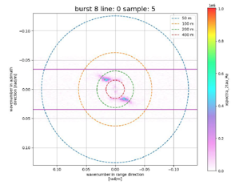

############################################################################
slcl1butils: functions to play with IFREMER L1B Sentinel-1 SLC SAR products
############################################################################

**slcl1butils** is a library to exploit level 1-B SAR SLC products. Objets manipulated are all `xarray`_.

Acquisition modes available in L1B IFREMER product family are IW and WV.

The products are *netCDF* files containing `xarray.datatree` object.

Documentation
-------------

Overview
........

**slcl1butils**  features:

#. helps to read L1B products (especially IW TOPS Scan SAR acquisitions) containing both intra burst and inter (i.e. overlapping bursts) burst cross spectrum.
#. contains the SAR processor Level-1B  -> Level-1C, allowing to co-locate and enrich the SAR acquisitions with WW3 grid, ECMWF grid and WW3-spectra.

Algorithm Technical Baseline Document
.....................................

.. note::
    The Algorithm Technical Baseline Document (ATBD) describes implemented processing steps from Sentinel-1 SLC product to Level-1C IFREMER products

* :doc:`atbd`

Examples
........

.. note::
    here are some examples of usage

* :doc:`examples/display_a_IW_L1B_xspectra`
* :doc:`examples/do_L1C_SAFE_from_L1B_SAFE_example`
* :doc:`examples/plotting_L1B_geometry_with_holoview_example`
* :doc:`examples/plotting_L1B_variables_with_holoview_example`

Reference
.........

* :doc:`basic_api`

Get in touch
------------

- Report bugs, suggest features or view the source code `on github`_.

----------------------------------------------

Last documentation build: |today|

.. toctree::
   :maxdepth: 2
   :caption: Home
   :hidden:

.. toctree::
   :maxdepth: 1
   :hidden:
   :caption: Getting Started

   installing

.. toctree::
   :maxdepth: 1
   :hidden:
   :caption: Algorithm description

   atbd

.. toctree::
   :maxdepth: 1
   :hidden:
   :caption: Examples

   examples/display_a_IW_L1B_xspectra
   examples/do_L1C_SAFE_from_L1B_SAFE_example
   examples/plotting_L1B_geometry_with_holoview_example
   examples/plotting_L1B_variables_with_holoview_example

.. toctree::
   :maxdepth: 1
   :hidden:
   :caption: Reference

   basic_api

.. _on github: https://github.com/umr-lops/utils_xsarslc_l1b
.. _xarray: http://xarray.pydata.org
